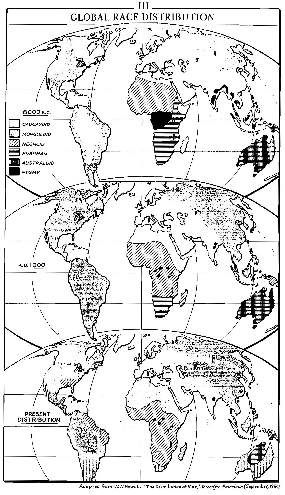
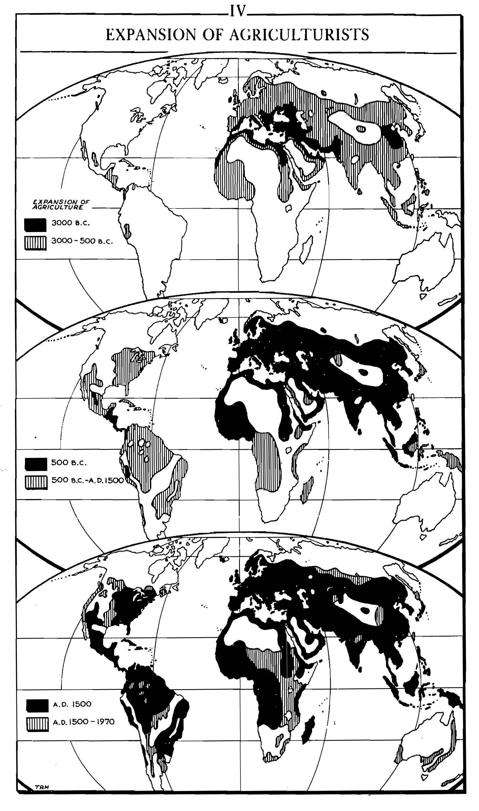
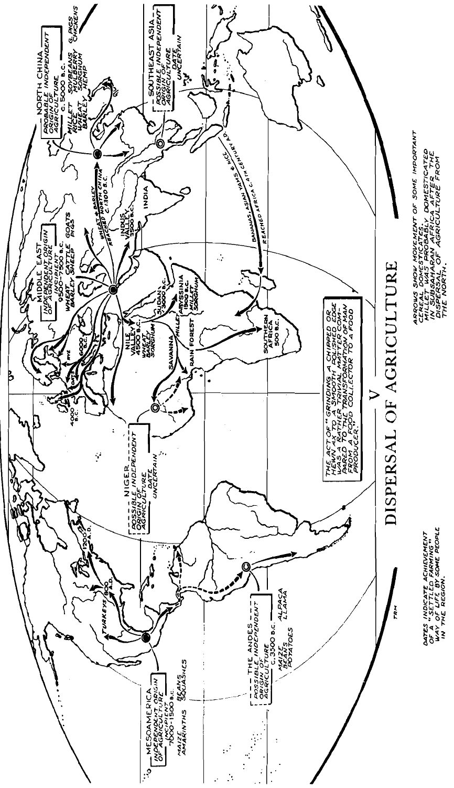

# A Global History (Stavrianos)

_A global history: from prehistory to the present, English version, 5th edition._

## Preface

The book is distinctive in three ways:

1. Connects the past to the present

1. Also connects the present and the future

   - History is a science and offers some predictability

1. Deals with a _world_ history

   - World history is not the sum of histories of civilizations of the world, rather is about the historical forces that affects the world as a whole.

Book 1 (before 1500):

- Paleolithic times

- Neolithic period; agriculture

- The Eurasian civilizations

Book 2 (after 1500): the Western European expansion

- The roots of European expansion

- The Confucian, Moslem and non-Eurasian worlds on the eve of Europe's expansion

- The stages of European expansion

## Part 1: Before Civilization

Focuses:

1. From hominid to Homo sapiens ("thinking human being")

2. From food gatherer to food producer

### Chapter 1: Humans As Food Gatherers

#### From Hominids to Humans

Hominids (mainly _Australopithecus_)

- 4 million years ago

- Walking erect on two legs

- 1/3 cranial capacity of a modern human

Homo erectus

- 2/3 brain capacity of human

- Make and use tool (e.g., hand axe)

- Social life:

  - Large-scale hunting of big games -- group organization, speech communication

  - Ritual burial -- reverence for the dead

- Decorative sense

- Use of fire $\rightarrow$ able to spread throughout the globe

Homo sapiens

- 40,000 years ago

- "Blade technique" -- tools to make tools

- Sewn skin garments

#### Life of Food Gatherers

- Social organization

  - Autonomous **band** of 20-50 persons
  
  - Family is the basis

- Social relations

  The essence is cooperation (for their bare existence)

  - Rare polygamy -- sex equality
  
  - Social equality
  
  - Economic cooperation

- Relation with nature and the supernatural

  - Static, ahistorical views and way of thinking
  
  - Lack explanatory knowledge; cannot naturalistically explain phenomena

- Specialists of ritual: _shaman_

#### Appearance of Races

- Major technological breakthrough $\rightarrow$ population explosion

  - Early Paleolithic: 125,000 hominids; the end of the Paleolithic: 5.32 million; over $42 \times$

- Population explosion $\rightarrow$ spread over larger areas

  - Australopithecus (hominid): within Africa savanna lands

  - Homo erectus: Africa $\rightarrow$ temperate zones of Eurasia; Java man, Peking man, Hiedelberg man

  - Homo sapiens: Siberian tundra, African & Southeast Asian tropical rain forests

- Dispersal $\rightarrow$ race differentiation

  - Happens late in time; all modern races "stem from a common stock"; able to interbreed,
    and "no significant differences in innate mental capacity among all races."

    

### Chapter 2: Humans As Food Growers

(Earlier) Paleolithic times: human learned to speak, to make tool, and to use fire; akin to animals,
humans were still food gatherers.

#### Origins of Agriculture

- Agriculture: start of _Neolithic_ age.

- Paleolithic humans understood the mechanics of plant growth; they didn't grow crops because

  - There's no incentive: humans were not starving or suffer from population explosion

  - Humans as hunters and gatherers had a greater variety of food, can work less,
  and can avoid unsanitary conditions due to settling down.

  - Plants and animals suitable for domestication is scarce.

- Shift to agriculture: 10,000 $\sim$ 2,000 years ago

  - No more places to migrate to $\rightarrow$ population density increases

  - Many more people per square mile can be supported by agriculture than by food gathering.

#### Spread of Agriculture

- (Independent) center of _agricultural revolution_:

  - the Middle East: wheat, oats, rye, and barley; goat, sheep, cattle, and pig

  - Mesoamerica: maize, beans, squashes

  - Northern China: millets, sorghum, soybeans, mulberry tree, lacquer tree

  - Other centers suggested by new discoveries

- Multi-species agriculture: higher productivity + subsistence security

- Incipient agriculture: earliest domestication to agricultural revolution

  - Gradual and prolonged; several millennia

  - 

- Diffusion of agriculture is sparked by the _inefficiency_ of early agriculture

  - Land is used for a few years $\rightarrow$ abandoned to restore fertility for $8 \sim 10+$ years

  - Recuperating land $:$ cultivated land is $5 \sim 10 : 1$

  - Constant shift-off from settlement to new lands

  - Middle East: spread to Indus valley, central Asia, eastern Europe

  - Africa: (most likely) from Middle East $\rightarrow$ Nile valley (4000 B.C.) $\rightarrow$ Sudan Negroes
  (3000 B.C.) $\rightarrow$ sub-Saharan Africa

  - New world: maize in Mexico, 7000 B.C.; two species of squash, the bottle gourd, tepary bean,
  chili peppers, amaranths, and avocados.

  - 

#### Varieties of Agriculture

- Three cereal areas (very generally speaking)

  - the rice area in East and Southeast Asia

  - the maize area in the Americas

  - the wheat area in Europe, the Middle East, North Africa, and central Asia to the Indus and Yellow River valleys

- Agricultural techniques / styles

  - Slash and burn: remove trees without iron tools

  - Terrace agriculture: prevent the damage of flash floods in mountainous areas

  - Vegetative root farming

  - Raised field agriculture (in Peru)

- Stock raising

  - In regions with too little rainfall for agriculture

  - _Pastoral nomads_ with their dogs, horses, camel ... -- always ready to strike the civilization centers

#### Life of the Food Growers

- Settle down to grow plants -- _bands_ gave way to _villages_

- Life was miserable in the beginning:

  - Low productivity

  - Hard labor and famine, malnutrition

  - Sanitation problems

  Higher birthrate compensated for low life expectancy

- Rapid technological progress

  - Sedentary life enabled a richer material existence
  
  - House furnishing, pottery, ovens (kilns), textiles...

- Social structure:

  - Tribal political structure; _tribes_, _chiefs_
  
  - _Extended family_ consisting of two or more couples and their children
  
  - **Social homogeneity**
  
    - A "built-in brake" on productivity
  
    - Egalitarian, but low productivity
  
  - Equality in social relations, and in sex relations

- Religion

  - A goddess of the earth or of fertility; the earth mother
    The source of productivity of plants and animals, and of the _fecundity_ of women

#### Demographic and Racial Results

- Human population: 5.32 million (10,000 BC) $\rightarrow$ 133 million (2,000 BC)

- Agriculture spreads long distance and converts hunters into agriculturalists

  - Race imbalance: Mongoloids, Caucasoids, Negroids outstood in number

## Part 2: Classical Civilization of Eurasia, to A.D. 500

Focus: _classical civilizations_ in _classical age_

- Prevalent creativity in different civilizations, each developing its own style
  (Unlike agricultural revolution, in which the Middle East took the major lead)

- Outward expansion, contact with each other

### First Eurasian Civilizations, 3500 - 1000 B.C.

- Earliest: Sumer
