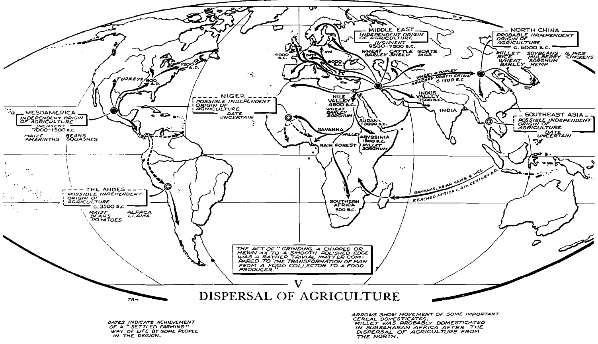

# A Global History (Stavrianos)

_A global history: from prehistory to the present, English version, 5th edition._

## Preface

The book is distinctive in three ways:

1. Connects the past to the present

1. Also connects the present and the future

   - History is a science and offers some predictability

1. Deals with a _world_ history

   - World history is not the sum of histories of civilizations of the world, rather is about the historical forces that affects the world as a whole.

Book 1 (before 1500):

- Paleolithic times

- Neolithic period; agriculture

- The Eurasian civilizations

Book 2 (after 1500): the Western European expansion

- The roots of European expansion

- The Confucian, Moslem and non-Eurasian worlds on the eve of Europe's expansion

- The stages of European expansion

## Part 1: Before Civilization

Focuses:

1. From hominid to Homo sapiens ("thinking human being")

2. From food gatherer to food producer

### Chapter 1: Humans As Food Gatherers

#### From Hominids to Humans

Hominids (mainly _Australopithecus_)

- 4 million years ago

- Walking erect on two legs

- 1/3 cranial capacity of a modern human

Homo erectus

- 2/3 brain capacity of human

- Make and use tool (e.g., hand axe)

- Social life:

  - Large-scale hunting of big games -- group organization, speech communication

  - Ritual burial -- reverence for the dead

- Decorative sense

- Use of fire $\rightarrow$ able to spread throughout the globe

Homo sapiens

- 40,000 years ago

- "Blade technique" -- tools to make tools

- Sewn skin garments

#### Life of Food Gatherers

- Social organization

  - Autonomous **band** of 20-50 persons
  
  - Family is the basis

- Social relations

  The essence is cooperation (for their bare existence)

  - Rare polygamy -- sex equality
  
  - Social equality
  
  - Economic cooperation

- Relation with nature and the supernatural

  - Static, ahistorical views and way of thinking
  
  - Lack explanatory knowledge; cannot naturalistically explain phenomena

- Specialists of ritual: _shaman_

#### Appearance of Races

- Major technological breakthrough $\rightarrow$ population explosion

  - Early Paleolithic: 125,000 hominids; the end of the Paleolithic: 5.32 million; over $42 \times$

- Population explosion $\rightarrow$ spread over larger areas

  - Australopithecus (hominid): within Africa savanna lands

  - Homo erectus: Africa $\rightarrow$ temperate zones of Eurasia; Java man, Peking man, Hiedelberg man

  - Homo sapiens: Siberian tundra, African & Southeast Asian tropical rain forests

- Dispersal $\rightarrow$ race differentiation

  - Happens late in time; all modern races "stem from a common stock"; able to interbreed,
    and "no significant differences in innate mental capacity among all races."

    

### Chapter 2: Humans As Food Growers

(Earlier) Paleolithic times: human learned to speak, to make tool, and to use fire; akin to animals,
humans were still food gatherers.

#### Origins of Agriculture

- Agriculture: start of _Neolithic_ age.

- Paleolithic humans understood the mechanics of plant growth; they didn't grow crops because

  - There's no incentive: humans were not starving or suffer from population explosion

  - Humans as hunters and gatherers had a greater variety of food, can work less,
  and can avoid unsanitary conditions due to settling down.

  - Plants and animals suitable for domestication is scarce.

- Shift to agriculture: 10,000 $\sim$ 2,000 years ago

  - No more places to migrate to $\rightarrow$ population density increases

  - Many more people per square mile can be supported by agriculture than by food gathering.

#### Spread of Agriculture

- (Independent) center of _agricultural revolution_:

  - the Middle East: wheat, oats, rye, and barley; goat, sheep, cattle, and pig

  - Mesoamerica: maize, beans, squashes

  - Northern China: millets, sorghum, soybeans, mulberry tree, lacquer tree

  - Other centers suggested by new discoveries

- Multi-species agriculture: higher productivity + subsistence security

- Incipient agriculture: earliest domestication to agricultural revolution

  - Gradual and prolonged; several millennia

  - 

- Diffusion of agriculture is sparked by the _inefficiency_ of early agriculture

  - Land is used for a few years $\rightarrow$ abandoned to restore fertility for $8 \sim 10+$ years

  - Recuperating land $:$ cultivated land is $5 \sim 10 : 1$

  - Constant shift-off from settlement to new lands

  - Middle East: spread to Indus valley, central Asia, eastern Europe

  - Africa: (most likely) from Middle East $\rightarrow$ Nile valley (4000 B.C.) $\rightarrow$ Sudan Negroes
  (3000 B.C.) $\rightarrow$ sub-Saharan Africa

  - New world: maize in Mexico, 7000 B.C.; two species of squash, the bottle gourd, tepary bean,
  chili peppers, amaranths, and avocados.

  - 

#### Varieties of Agriculture

- Three cereal areas (very generally speaking)

  - the rice area in East and Southeast Asia

  - the maize area in the Americas

  - the wheat area in Europe, the Middle East, North Africa, and central Asia to the Indus and Yellow River valleys

- Agricultural techniques / styles

  - Slash and burn: remove trees without iron tools

  - Terrace agriculture: prevent the damage of flash floods in mountainous areas

  - Vegetative root farming

  - Raised field agriculture (in Peru)

- Stock raising

  - In regions with too little rainfall for agriculture

  - _Pastoral nomads_ with their dogs, horses, camel ... -- always ready to strike the civilization centers

#### Life of the Food Growers

- Settle down to grow plants -- _bands_ gave way to _villages_

- Life was miserable in the beginning:

  - Low productivity

  - Hard labor and famine, malnutrition

  - Sanitation problems

  Higher birthrate compensated for low life expectancy

- Rapid technological progress

  - Sedentary life enabled a richer material existence
  
  - House furnishing, pottery, ovens (kilns), textiles...

- Social structure:

  - Tribal political structure; _tribes_, _chiefs_
  
  - _Extended family_ consisting of two or more couples and their children
  
  - **Social homogeneity**
  
    - A "built-in brake" on productivity
  
    - Egalitarian, but low productivity
  
  - Equality in social relations, and in sex relations

- Religion

  - A goddess of the earth or of fertility; the earth mother
    The source of productivity of plants and animals, and of the _fecundity_ of women

#### Demographic and Racial Results

- Human population: 5.32 million (10,000 BC) $\rightarrow$ 133 million (2,000 BC)

- Agriculture spreads long distance and converts hunters into agriculturalists

  - Race imbalance: Mongoloids, Caucasoids, Negroids outstood in number

### Highlights

1. Are human beings aggressive or cooperative by nature? Neither.

   Arguments in both direction have been made, and proofs for either side has been found.
   The tribe of Tasaday is marked for their complete lack of aggressiveness, while Fentous are
   generation after generation fierce fighters.
   This highly suggests that a perference for peace or war is not nature, but nurture.

   This question is critical because, as a part of the technology leaps, we are becoming increasingly
   likely to destroy ourselves. Wars have become more deadly as well as more frequent.
   The Peolithic period did not see many wars because there are not much to gain in fighting,
   and too much to lose -- might just be the whole humanity -- over not cooperating to deal with the
   harsh nature. Over time there came more incentives to fight over more assets, and the ways of killing
   became more advanced.

   It's important to see that war is *not* inevitable -- because it's in the culture, not the nature -- but
   something needs to be done.

## Part 2: Classical Civilization of Eurasia, to A.D. 500

Focus: _classical civilizations_ in _classical age_

- Prevalent creativity in different civilizations, each developing its own style
  (Unlike agricultural revolution, in which the Middle East took the major lead)
- Outward expansion, contact with each other

### Chapter 3: First Eurasian Civilizations, 3500 - 1000 B.C.

- Earliest: Sumer, "the land of Shinar", on Mesopotamia (current-day Iraq), around 3500 B.C.
  - The conversion from tribalism to civilization is not an event (immediate) but a process (over time),
    and 3500 B.C is an estimation.

#### Civilization

Civilization is a rough concept supported by several characteristics (criteria) that not all civilizations
exactly satisfies, including:

- Urban center
- Institutionalized political authority in the form of the state
- Tribute or taxation
- Writing
- Social stratification into classes or hierarchies
- Monumental architecture
- Specialized arts and sciences

#### How Ancient Civilizations Began

Examine how the chain reaction happened in the Middle-East, from the tribal society on the hills over
Tigris-Euphrates, to what is now known as the Akkadian Empire.

1. People are moving down to the river valley from the hills.
   This new environment imposed some challenges such as inadequate rainfall, searing heat, periodic floods,
   and lack of stone for building, but there were advantages that far outweighed the difficulties.

   In this period, difficulties of the new environment stimulated **new technologies**, which in turn more than
   compensated for the difficulties.

   *Irrigation*: Farmers began to dug short canals from the river to their field to compensate for the
   lacking rainfall. Irrigated, the rich alluvial soil in the valley yielded an incredibly large amount
   of crops compared to before.

   *Metallurgy*: due to the lack of flint in the valley. Started from copper which has a low melting point,
   and over time, it was found that adding tin to copper increases the durability of the resulting metal.
   This is the bronze.

   Powers other than muscle power came into use. A simple form of *plow* emerged, powered by a pair of oxen;
   on the sea, wind power was harnessed for water transport.

1. **Institutional changes** came hand-in-hand with these technological changes, and this is a reciprocal process.

   Class differentiation started from the priests, who were successors of the old-day shaman.
   Shaman had been highly influential in the tribal villages due to the importance of agricultural ceremonies,
   but that wasn't a full-time position.
   Now, simply put, the growth in food surplus freed a part of people from agricultural production -- here the
   priests -- thus giving form the a full-time priesthood.

   Priests started to bear more managerial responsibilities, keeping records for major events such as the
   annual floods (inventing writing along the way), which in turn contributed to economy and technology.
   Priesthood also stimulated craft, which was mainly designed for the temples.
   This was a time when both the scale and the heterogeneity of the society was growing.

1. The efficacy of *religious sanction* diminished in the unprecedentedly large and complex towns.
   Warfare was growing in scale and frequency due to population growth, and the wealth of temples
   attracting raids possibly contributed as well.
   As a result, the status of *religious elite* were undermined.

   In the meantime, as the frequency of wars was increasing, and period of peace shrinking, the tenure of
   war leaders became longer, until finally they were ensconced as permanent military chiefs, and
   eventually as kings.

   The palaces came to rival the temples, and there came the tense *working partnership* between secular kings
   and religious elites. (which is a recurring theme in the following many centuries, as we all more or less
   know what unraveled in the Europe continent...)

1. Secular states stimulated more need of non-agricultural commodities and led to an increase in its production.
   Luxury commodities in great quantity were absorbed by the growing palace retinues; increasing militarization required armaments on an unprecedented scale.

   This increasing production incurred an increasing need for raw materials, such as minerals and timbers, which
   had to be brought from outside. Local products were exported in exchange, and yet another option was to conquer
   the conquer the sources of the needed raw materials.

   Again the enlarging of *military and palace establishments* were reciprocal. The cost of this undermined the
   traditional assemblies, who then were increasingly bypassed a *permanent, hereditary royal authority*.
   Here comes the centralization of political power. This then led to more *class differentiation*, which we
   can tell by looking at the graves.

#### How Ancient Civilizations Spread

This was a time when civilization extended outwards, claiming and transforming uncivilized regions, replacing
the tribal societies.
They were replaced because they could not compete with civilizations that were much more *productive*.
These class societies squeezed taxes and rents out of the peasants to the higher classes, and the peasants had
to work infinitely harder than did the tribal cultivators.

The civilizations on the banks of the Tigris-Euphrate, the Nile, the Indus, and the Yellow river all underwent
similar expansion and spread.
By the time of Christ it extended with virtually no interruption from the English Channel to the China Sea.

In the same way 3500 B.C. is estimated as the dawn of civilization on Mesopotamia, time may be given for other
centers of civilizations:

- In Egypt, about 3000 B.C.
- In the Indus valley, about 2500 B.C.
- In the Yellow River valley of China, about 1500 B.C.
- In Mesoamerica and Peru, about 500 B.C.

#### Styles of Civilizations

First up, what was in common of all the civilizations? Inequality.

- Social inequality: it was common for peasant / workers to be treated rather harshly.
  They suffered from heavy labor, malnutrition, and thus generally worse health condition and shorter lifespan,
  and their labor went to the upper classes in the form of taxes, rents, and labor services.

- Sex inequality: women gradually fell out of being *equal food producer* as men, as the new agriculture became
  less suited for women -- either because it was too heavy or because it kept them away from the children too long.
  
  Woman subsequently were left home to do the "inside work" -- the first time there was a distinction between
  "inside" and "outside" work -- and became dependent, and thus *secondary*.
